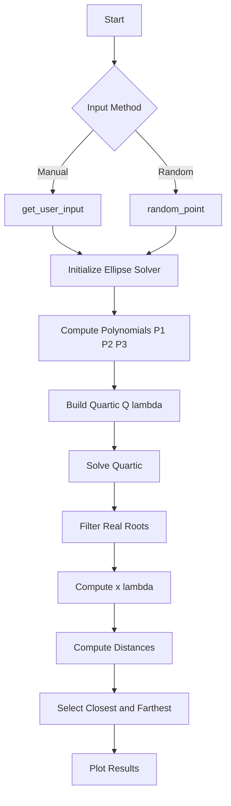
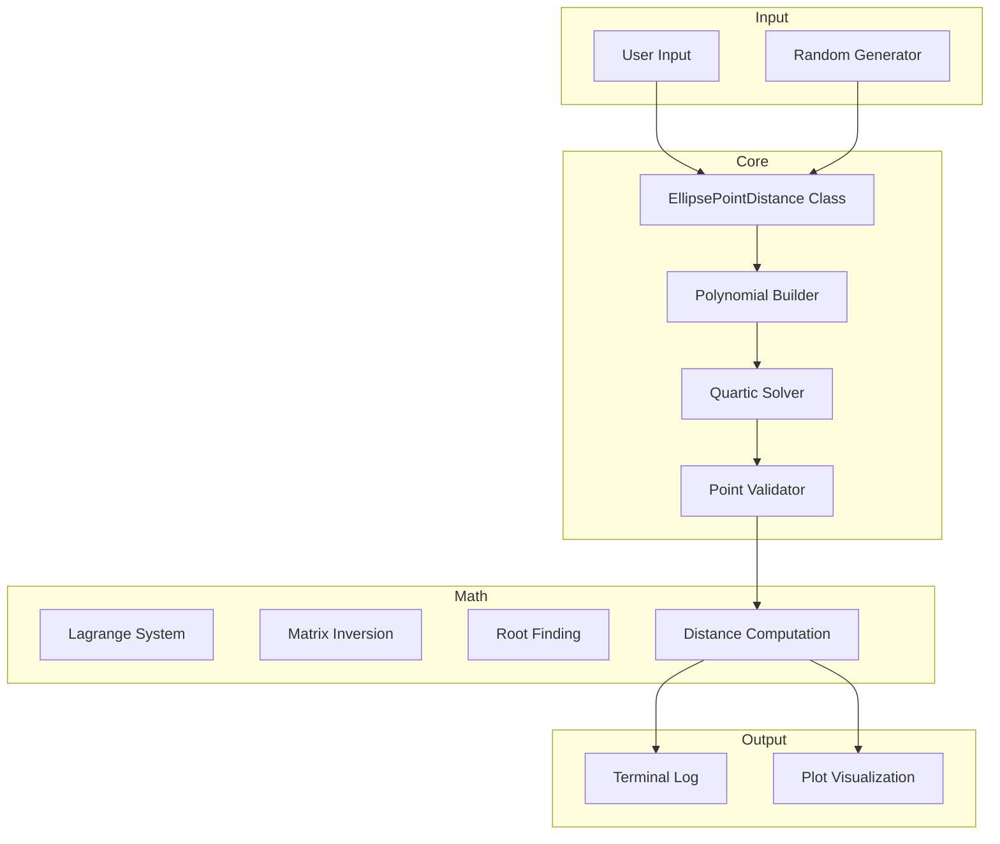
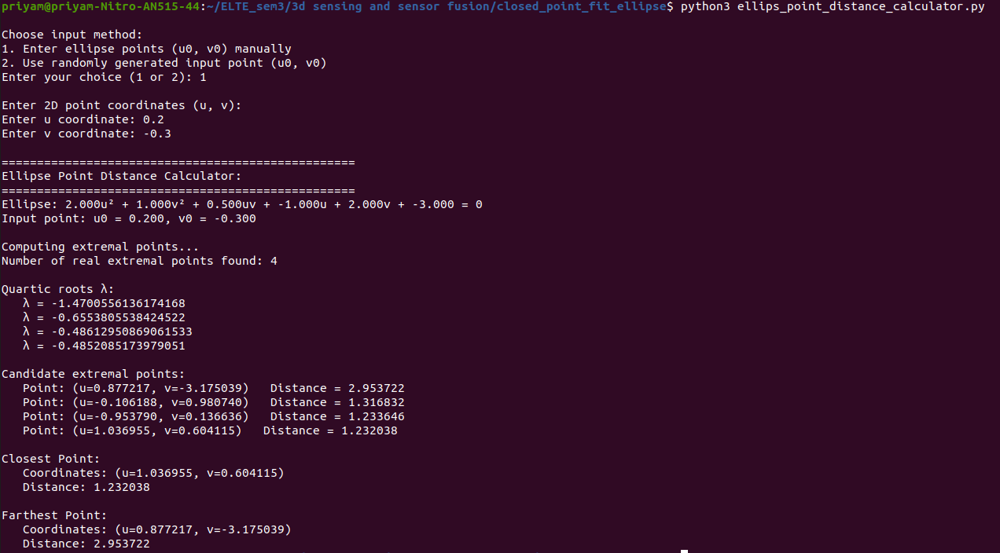
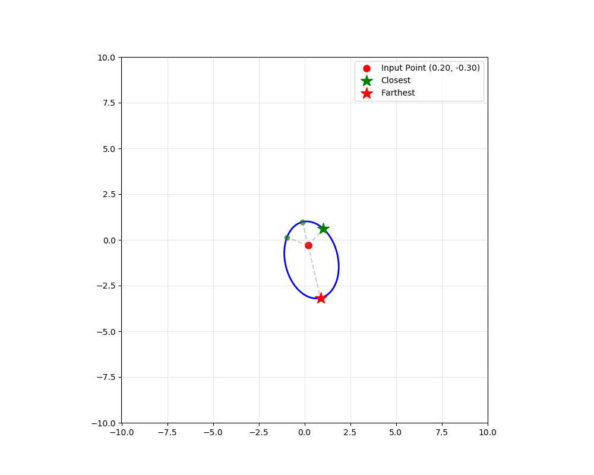

# Ellipse Point Distance Calculator — Closest/Furthest Point on an Ellipse


**Author:** Priyam Gupta         
**Neptun Code:** KXHGEA

---

## Table of Contents
1. [Introduction](#introduction)  
2. [Mathematical Theory](#mathematical-theory)  
3. [Algorithm Summary (Analytic)](#algorithm-summary-analytic)  
4. [Implementation Details](#implementation-details)  
5. [Execution Flow](#execution-flow)  
6. [System Architecture](#system-architecture)  
7. [Results Example](#results-example)  

---

# Introduction

This project implements an **analytic algorithm** for computing:

- the **closest point**, and  
- the **farthest point**

on a **general conic ellipse** relative to a 2D point $(u_0, v_0)$.  

*No numerical optimization is used — only algebraic formulation, Lagrange multipliers, matrix inversion, and quartic polynomial root solving.*

We generate:
- a random ellipse,
- a random or user-given point,
- solve analytically for extremal distance points,
- visualize everything.

---

# Mathematical Theory

## 1. Ellipse (Implicit) Form

A general conic ellipse is defined as:

$$
                A u^2 + B v^2 + C u v + D u + E v + F = 0 .
$$

Let

$$
        \mathbf{x} = \begin{bmatrix} 
                                        u \\
                                        v
                        \end{bmatrix}.
$$

Define the quadratic and linear terms:

$$
        \tilde{M} =
                    \begin{bmatrix}
                                    A & \tfrac{C}{2} \\
                                    \tfrac{C}{2} & B
                    \end{bmatrix},
        \qquad
        \mathbf{a} =
                    \begin{bmatrix}
                                    \tfrac{D}{2} \\
                                    \tfrac{E}{2}
                    \end{bmatrix}.
$$

The ellipse can be expressed in homogeneous matrix form:

$$
        \begin{bmatrix} 
                        {x^T} & 1 
        \end{bmatrix}
        \begin{bmatrix}
                        \tilde{M} & {a} \\
                        {a^T}     & {F}
        \end{bmatrix}
        \begin{bmatrix}
                        {x} \\
                        1
        \end{bmatrix}
        = 0.
$$

Ellipse validity condition:

$$
                \det(\tilde{M}) = AB - \frac{C^2}{4} > 0. 
$$

---

## 2. Constrained Optimization Problem

We want to extremize the squared Euclidean distance:

$$
                D(x) = \|{x} - {x_0}\|^2 = (u - u_0)^2 + (v - v_0)^2,
$$

subject to the ellipse constraint:

$$
                g(x) = {x^T} \tilde{M} {x} + 2 {a^T} {x} + F = 0.
$$

---

## 3. Lagrangian Formulation

The Lagrangian is:

$$
                \mathcal{L}(x, \lambda) = \|{x} - {x_0}\|^2 + \lambda g(x).
$$

Stationarity condition:

$$
                \nabla_\mathbf{x} \, \mathcal{L} = 0
$$

gives the linear system:

$$
                (I + {\lambda} \tilde{M}) {x} = {x_0} - {\lambda} {a}.
$$

Thus,

$$
                {x}(\lambda) = (I + {\lambda} {\tilde{M}})^{-1} ({x_0} - {\lambda} {a}).
$$

Substitute into $( g(x)=0 )$ to obtain a **quartic**:

$$
                Q(\lambda) = 0.
$$

Real λ values produce real candidate points on the ellipse.

---

# Algorithm Summary (Analytic)

1. Input ellipse coefficients \(A,B,C,D,E,F\)  
2. Validate ellipse using \(\det(\tilde{M})>0\)  
3. Build polynomials \(P_1(\lambda), P_2(\lambda), P_3(\lambda)\)  
4. Construct quartic  
   $$
   Q(\lambda)
   =
   \begin{bmatrix} P_1 \\ P_2 \end{bmatrix}^\top
   \tilde{M}
   \begin{bmatrix} P_1 \\ P_2 \end{bmatrix}
   +
   2 P_3 \,\mathbf{a}^\top
   \begin{bmatrix} P_1 \\ P_2 \end{bmatrix}
   +
   F\, P_3^2
   $$
5. Solve quartic using `numpy.roots`  
6. Keep real roots  
7. For each λ compute:  
   $$
   \mathbf{x}(\lambda)
   =
   (I+\lambda\tilde{M})^{-1}
   (\mathbf{x}_0 - \lambda \mathbf{a})
   $$
8. Compute distances  
9. Choose min → closest, max → farthest  
10. Plot ellipse + points + connecting lines  

---

# Implementation Details

### Languages & Libraries
- **Python 3**
- `numpy` (polynomials + algebra)
- `matplotlib` (visualization)
- No numerical optimization algorithms

### Tolerances
- Real root:  
  $$
                |\operatorname{Im}(\lambda)| < 10^{-8}
  $$

- Ellipse constraint check:  
  $$
                |g(\mathbf{x})| < 10^{-6}
  $$

### Stability note
Ensure:
$$
                \det(I + {\lambda} {\tilde{M}}) \neq 0
$$
before matrix inversion.

---

# Execution Flow

<div align="center">



</div>

---

# System Architecture

<div align="center">



</div>

---

# Results Example

### Input point
```
(u0, v0) = (0.2, -0.3)
```

### Terminal Output (example)

<div align="center">



</div>

### Plot Example

<div align="center">



</div>

---

